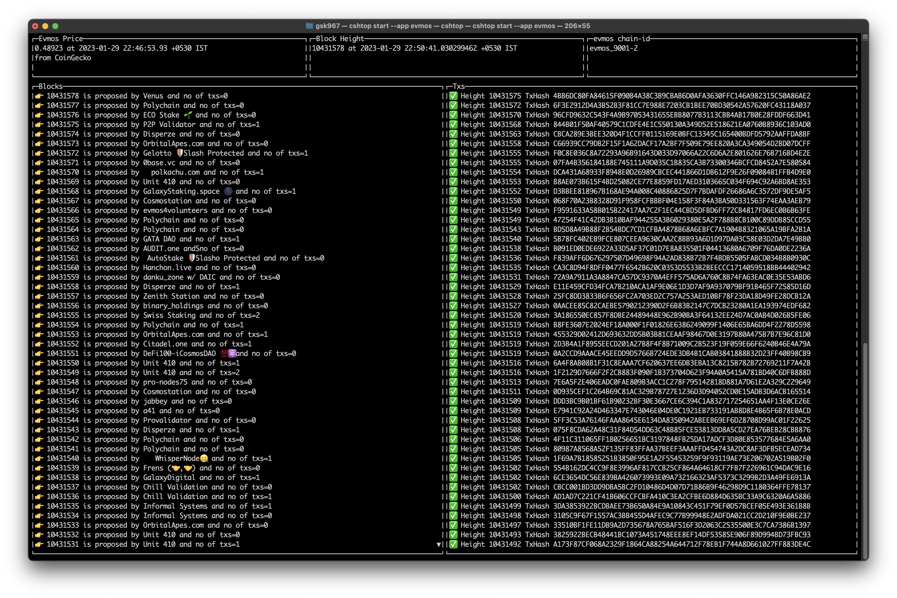

## cshtop (cosmos htop)
> Real time block explorer for cosmos-sdk based chains


## Install 
```bash
make install
```
## Run the application
```bash
## NoteL make appName should match with chain registry folder name https://github.com/cosmos/chain-registry/
$ cshtop start --app cosmoshub

# override the rpc and rest uri
$ go run main.go start --app <appName>  --rpc <rpc> --rest <rest>
# or
$ cshtop start --app cosmoshub --rpc https://rpc-cosmoshub.whispernode.com:443 --rest https://lcd-cosmoshub.whispernode.com:443
```

## Supported Apps 
- [x] cosmos (cosmoshub)
- [x] akash
- [x] sentinel
- [x] umee
- [x] agoric
- [x] assetmantle
- [x] axelar
- [x] osmosis
- [x] bitcanna
- [x] bitsong
- [x] cerberus
- [x] chihuahua
- [x] comdex
- [x] desmos
- [x] regen
- [x] juno
- [x] evmos
- [x] passage
- [x] fetchhub
- [x] starname
- [x] stride
- [x] stargaze
- [x] kava 
- [x] persistence
- [x] teritori

## User Interface
